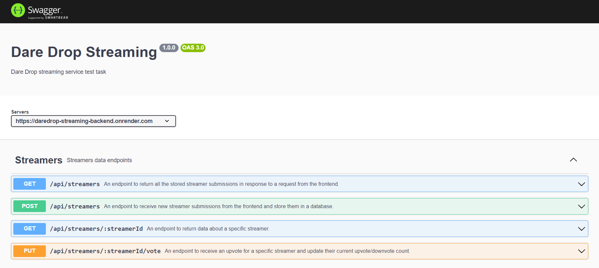

# Dare Drop Streaming Backend

This backend servise is intended to work with the front-end part of the Dare Drop Streaming web-app, created on terms of the Dare Drop test task.

### Base URL

The backend part of this web-app is located at render.com web service.
The base URL is indicated below:

```javascript
BASE_URL = "https://daredrop-streaming-backend.onrender.com";
```

### Endpoints

The endpoints avaliable are listed below:

The **streamers endpoint** is avaliable at the route

```javascript
"/api/auth";
```

Endpoints avaliable:  
**"/"** - POST endpoint to receive new streamer submissions from the frontend and store them in a database;  
**"/"** - GET endpoint to return all the stored streamer submissions in response to a request from the frontend;  
**"/streamerId"** - GET endpoint to return data about a specific streamer;  
**"/streamerId/vote"** - PUT endpoint to receive an upvote for a specific streamer and update their current upvote/downvote count;

### Swagger Docs

Detailed API documentation is avaliable at [this endpoint](https://daredrop-streaming-backend.onrender.com/api-docs)

```javascript
"https://daredrop-streaming-backend.onrender.com/api-docs";
```



### Technology stack

Backend part of the web-app was created using indicated tech stack:

<code></code>
<code></code>
<code></code>
<code></code>
<code></code>
<code></code>
<code></code>
<code></code>
<code></code>
